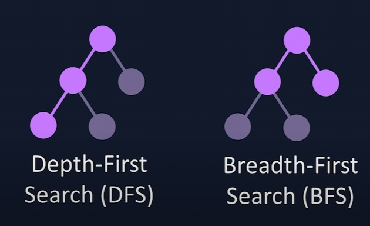
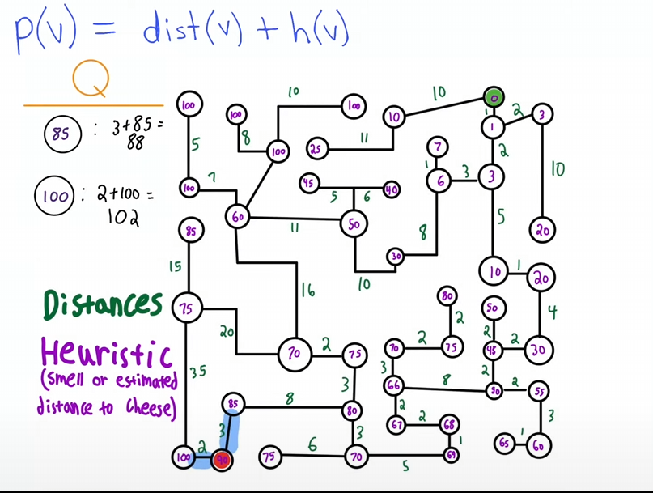
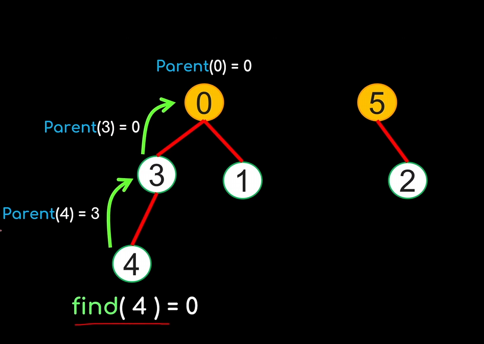
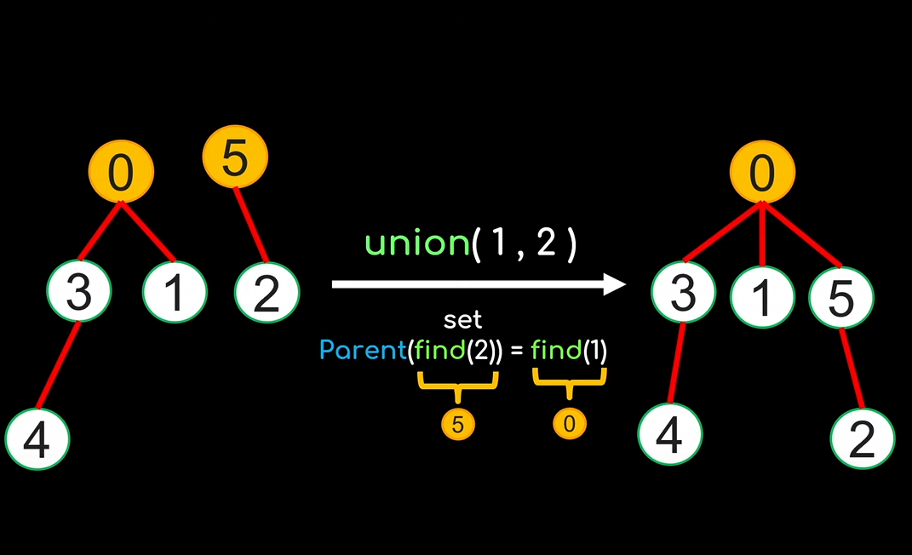

# Questions

```mdx-code-block
import Tabs from '@theme/Tabs';
import TabItem from '@theme/TabItem';
import CodeBlock from '@theme/CodeBlock';
```

## Object-Oriented Programming

**1.1 What is the difference between ref and value types in C#?**

- **Value types** (e.g., `int`, `struct`) hold data directly, and changes inside methods don’t affect the original.
- **Reference types** (e.g., `class`, `string`) hold references to data, and changes affect the original object.

**1.2 What is the difference between struct and class in C#?**

- **Struct**: A value type stored in memory directly. Ideal for lightweight objects like coordinates. Does not support inheritance and **CANNOT** be null.
- **Class**: A reference type stored in heap memory. Suitable for complex objects and supports inheritance, polymorphism and can be null.

**1.3 What is an enum in C#?**

- **Enum** is a A value type that defines a set of named values, which are usually constants.

**1.4 What is the difference between heap and stack memory?**

| **Aspect**        | **Stack**                                      | **Heap**                                           |
| ----------------- | ---------------------------------------------- | -------------------------------------------------- |
| **Definition**    | Memory for local variables and function calls. | Memory for dynamically allocated objects.          |
| **Speed**         | Faster (LIFO order).                           | Slower (needs memory management).                  |
| **Size**          | Limited and fixed.                             | Larger, but can fragment.                          |
| **Storage**       | Stores value types and references.             | Stores objects and reference type data.            |
| **Lifetime**      | Managed automatically.                         | Must be managed manually or by garbage collection. |
| **Use Case**      | Short-lived data like local variables.         | Long-lived or dynamic data like objects.           |
| **Common Issues** | StackOverflow (deep recursion).                | Fragmentation, memory leaks.                       |

**1.5 Explain SOLID Principles**

| **Principle**                                 | **Description**                                                                                                                                                                  |
| --------------------------------------------- | -------------------------------------------------------------------------------------------------------------------------------------------------------------------------------- |
| **S - Single Responsibility Principle (SRP)** | A class should have only one reason to change, meaning it should have only one job or responsibility.                                                                            |
| **O - Open/Closed Principle (OCP)**           | Software entities (classes, modules, functions) should be open for extension, but closed for modification.                                                                       |
| **L - Liskov Substitution Principle (LSP)**   | Child class should be able to do the same thing as its parent class.                                                                                                             |
| **I - Interface Segregation Principle (ISP)** | A client should not be forced to depend on interfaces it doesn't use. It's better to have smaller, more specific interfaces.                                                     |
| **D - Dependency Inversion Principle (DIP)**  | High-level modules should not depend on low-level modules. Both should depend on abstractions. Abstractions should not depend on details; details should depend on abstractions. |

**1.6 What is garbage collection in C#?**

- Garbage collection automatically frees memory by removing objects no longer in use, preventing memory leaks.
  - Objects are stored in the managed heap.
  - They are categorized into Generations (0, 1, 2) for efficient cleanup.
  - Use IDisposable for resource cleanup instead of relying on finalization

**1.7 What is a partial class in C#?**

- A class split into multiple files for better organization. All parts are combined into one class during compilation.

**1.8 What is a pointer type in C#?**

- A pointer holds the memory address of a variable. It is used in **unsafe** code for scenarios like direct memory manipulation.

**1.9 What is the difference between abstract classes and interfaces?**

- **Abstract classes**: Can have method implementations and fields. Used when objects share common behavior.
- **Interfaces**: Only define method signatures. Useful for defining capabilities without shared implementation.

**1.10 What is the difference between `is` and `as` in C#?**

- `is`: Checks if an object is of a specific type. Returns a boolean.
- `as`: Tries to cast an object to a specific type. Returns `null` if it fails.

**1.11 What are the common design patterns in C#?**

| **Pattern**    | **Description**                                                                                           | **Disadvantages**                                                                                               |
| -------------- | --------------------------------------------------------------------------------------------------------- | --------------------------------------------------------------------------------------------------------------- |
| **Singleton**  | Ensures a class has only one instance and provides a global point of access.                              | Can lead to tightly coupled code, makes testing harder, and violates the Single Responsibility Principle.       |
| **Factory**    | Creates objects without specifying the exact class. It decouples creation logic from client code.         | Adds complexity and can make debugging more challenging due to hidden creation logic.                           |
| **Observer**   | Establishes a one-to-many dependency for notifying dependent objects when the state of an object changes. | Can lead to memory leaks if observers are not properly deregistered and makes debugging event chains difficult. |
| **Decorator**  | Adds responsibilities to an object dynamically, providing a flexible alternative to subclassing.          |
| **Strategy**   | Defines a family of algorithms, encapsulates each one, and allows them to be interchangeable at runtime.  |
| **Repository** | Encapsulates data access logic, separating it from business logic for easier maintenance and testing.     |

**1.12 What is the difference between an array and an ArrayList? When should you use an ArrayList over an array?**

- **Array**: Fixed size, stores elements of the same type.
- **ArrayList**: Dynamic size, can store elements of different types but lacks type safety.
- Use an **ArrayList** when the size of the collection changes frequently or elements of mixed types need to be stored.

---

## Additional Questions

**2.1 How does async/await work in C#?**

- Simplifies asynchronous programming by letting code run without blocking the main thread.

**2.2 How does dependency injection work in C#?**

- A design pattern to provide dependencies to objects, improving modularity and testing.

**2.3 Explain LINQ and its significance in C#.**

- LINQ (Language Integrated Query) allows querying data using SQL-like syntax. Improves code readability.

**2.4 What is the dynamic type in C#, and how does it differ from var?**

- **Dynamic**: Runtime type resolution.
- **Var**: Compile-time type inference.

---

## Data Structures and Algorithms

**3.1 What is the time complexity (Big O)? what is the Big O of arrays and lists?**

- Time complexity measures how the running time of an algorithm changes as the input size increases (helps evaluate how efficient an algorithm is). It's usually expressed in Big O notation:
  - **O(1):** Constant time – time doesn't change with input size.
  - **O(log n):** Logarithmic time – time grows slowly.
  - **O(n):** Linear time – time grows directly with input size.
  - **O(n log n):** Log-linear time – common in efficient sorting.
  - **O(n²):** Quadratic time – time grows faster (e.g., with nested loops).
  - **O(2^n):** Exponential time – time grows very quickly.


- **Array**: Access is `O(1)`, insertion/deletion is `O(n)`.
- **List**: Access is `O(n)`, insertion/deletion is `O(1)` for linked lists.

**3.2 Algorithms in C#**

### Sort Algorithms

#### Bubble Sort

<Tabs>
<TabItem value="Definition" label="Definition">
- Bubble sort a simple sorting algorithm that works by swapping the items between them if they are in the wrong order.
- The worst and average-case complexity of the Bubble Sort is О(n2), meaning that the data is in the opposite order we want to sort, or the elements are arbitrarily distributed in the list.
- The best-case complexity is O(n). That's the case where the data is already sorted.

Bubble sort is used when :

- simple code is preferred;
- the complexity doesn't matter.


</TabItem>
<TabItem value="code" label="Code">
<CodeBlock language="cs" showLineNumbers={true}>
{` static void BubbleSort(int[] data)
    {
        for (int i = 0; i < data.Length - 1; i++)
        {
            bool swapped = false;
            // Traverse the array and swap adjacent elements if needed
            for (int j = 0; j < data.Length - i - 1; j++)
            {
                if (data[j] > data[j + 1])
                {
                    // Swap the elements
                    (data[j], data[j + 1]) = (data[j + 1], data[j]);
                    swapped = true;
                }
            }
            // If no elements were swapped, the array is already sorted
            if (!swapped) break;
        }
    }`}

</CodeBlock>
</TabItem>
</Tabs>

---

#### Selection Sort

<Tabs>
<TabItem value="Definition" label="Definition">
- Selection sort works in one of two ways: It either looks for the smallest item in the list and places it in the front of the list (ensuring that the item is in its correct location) or looks for the largest item and places it in the back of the list.
- Selection Sort has the same complexities as Bubble Sort.

Selection Sort is used when:

- Sorting small arrays
- Checking off all the elements is compulsory
- Less swapping is required


**Explain**: red = currentMin, blue = current. As blue go down if blue < red update red. Move the final red to the sorted partition and move on to the next integration
</TabItem>
<TabItem value="code" label="Code">
<CodeBlock language="cs" showLineNumbers={true}>
{` static void SelectionSort(int[] data)
    {
        for (int i = 0; i < data.Length; i++)
        {
            int minIndex = i;
            // Find the index of the smallest element in the remaining array
            for (int j = i + 1; j < data.Length; j++)
            {
                if (data[j] < data[minIndex])
                    minIndex = j;
            }
            // Swap the current element with the smallest element found
            (data[i], data[minIndex]) = (data[minIndex], data[i]);
        }
    }`}
</CodeBlock>
</TabItem>
</Tabs>

---

#### Insertion Sort

<Tabs>
<TabItem value="Definition" label="Definition">
- Insertion Sort works by choosing an item and by ordering the directs neighbors whether they are greater/smaller than the chosen item. As the number of sorted items builds, the algorithm checks new items against the sorted items and inserts the new item into the right position in the list.
- Insertion Sort has a worst and average complexity case of O(n2). This occurs respectively when the array is sorted in reverse order and when the elements are arbitrarily organized in the array.
- The best-case complexity is O(n). It occurs when the data is already sorted in the desired order.

Insertion Sort is used when :

- There are a few elements left to sort;
- The array is small.


</TabItem>
<TabItem value="code" label="Code">
<CodeBlock language="cs" showLineNumbers={true}>
{` static void InsertionSort(int[] data)
    {
        for (int scanIndex = 1; scanIndex < data.Length; scanIndex++)
        {
            int tmp = data[scanIndex];
            int minIndex = scanIndex;
            // Shift elements to the right to create the correct position for tmp
            while (minIndex > 0 && tmp < data[minIndex - 1])
            {
                data[minIndex] = data[minIndex - 1];
                minIndex--;
            }
            // Place the element in the correct position
            data[minIndex] = tmp;
            // Print the array after each insertion
            Console.WriteLine(string.Join(", ", data));
        }
    }`}
</CodeBlock>
</TabItem>
</Tabs>

---

#### Quick sort

<Tabs>
<TabItem value="Definition" label="Definition">
- Implement a QuickSort algorithm requires to choose a pivot, then split the array into two sub-arrays according to the pivot, then arrange them following if they are greater/smaller than the pivot. Then we sort the two sub-arrays and repeat the process again.
- QuickSort has worst-case complexity of O(n2). It occurs when the pivot element picked is always either the greatest or the smallest element.
- The best-case and average-case complexity are O(n*log(n)). It occurs when the pivot element is always the middle element or near to the middle element.

QuickSort is used when :

- Recursion is needed and supported;
- The array is small;
- There are a few elements left to sort.


</TabItem>
<TabItem value="code" label="Code">
<CodeBlock language="cs" showLineNumbers={true}> {`

    // Method to perform Insertion Sort
    static void QuickSort(int[] data, int left, int right)
    {
        if (right <= left)
            return;

        // Partition the array and get the pivot index
        int pivot = Partition(data, left, right);
        // Recursively sort elements before and after the pivot
        QuickSort(data, left, pivot - 1);
        QuickSort(data, pivot + 1, right);
    }

    // Helper method to partition the arrays
    static int Partition(int[] data, int left, int right)
    {
        int pivot = data[left];
        int leftIndex = left + 1;
        int rightIndex = right;

        while (true)
        {
            // Move the left index to the right as long as elements are <= pivot
            while (leftIndex <= rightIndex && data[leftIndex] <= pivot)
                leftIndex++;

            // Move the right index to the left as long as elements are >= pivot
            while (rightIndex >= leftIndex && data[rightIndex] >= pivot)
                rightIndex--;

            // If pointers cross, break the loop
            if (rightIndex <= leftIndex)
                break;

            // Swap elements at leftIndex and rightIndex
            (data[leftIndex], data[rightIndex]) = (data[rightIndex], data[leftIndex]);
            Console.WriteLine(string.Join(", ", data));
        }

        // Place the pivot in the correct position
        (data[left], data[rightIndex]) = (data[rightIndex], data[left]);
        Console.WriteLine(string.Join(", ", data));

        return rightIndex;
    }`}

</CodeBlock>
</TabItem>
</Tabs>

---

#### Merge Sort

 <Tabs>
<TabItem value="Definition" label="Definition">
- A Mergesort works by applying the divide and conquer approach. The sort begins by breaking the dataset into individual pieces and sorting the pieces. It then merges the pieces in a manner that ensures that it has sorted the merged piece.
The sorting and merging continue until the entire dataset is again a single piece.
- MergeSort has worst-case and average-case complexity of `O(n*log(n))` which makes it fastest than some of the other sorting algorithms.


</TabItem>
<TabItem value="code" label="Code">
<CodeBlock language="cs" showLineNumbers={true}>
{`

    // Method to perform Merge Sort
    static int[] MergeSort(int[] data)
    {
        // Base case: if the array has fewer than 2 elements, it is already sorted
        if (data.Length < 2)
            return data;

        int middle = data.Length / 2;

        // Divide the array into left and right halves
        int[] left = MergeSort(data[..middle]);
        int[] right = MergeSort(data[middle..]);

        // Merge the sorted halves
        Console.WriteLine("The left side is: " + string.Join(", ", left));
        Console.WriteLine("The right side is: " + string.Join(", ", right));
        int[] merged = Merge(left, right);
        Console.WriteLine("Merged: " + string.Join(", ", merged));

        return merged;
    }

    // Helper method to merge two sorted arrays
    static int[] Merge(int[] left, int[] right)
    {
        int[] result = new int[left.Length + right.Length];
        int leftIndex = 0, rightIndex = 0, resultIndex = 0;

        // Merge elements from left and right arrays
        while (leftIndex < left.Length && rightIndex < right.Length)
        {
            if (left[leftIndex] < right[rightIndex])
                result[resultIndex++] = left[leftIndex++];
            else
                result[resultIndex++] = right[rightIndex++];
        }

        // Append any remaining elements from the left array
        while (leftIndex < left.Length)
            result[resultIndex++] = left[leftIndex++];

        // Append any remaining elements from the right array
        while (rightIndex < right.Length)
            result[resultIndex++] = right[rightIndex++];

        return result;
    }`}

</CodeBlock>
</TabItem>
</Tabs>

### Search Algorithms

#### Binary Search

<Tabs>
<TabItem value="Definition" label="Definition">
-In Binary search algorithm, it begins with an interval covering the whole array and diving it in half.

Points to note:

- The array needs to be sorted
- Performs ordering comparisons
- Time complexity to `O(log n)`.
- Search is done to either half of the given list, thus cut down your search to half time


</TabItem>
<TabItem value="code" label="Code">
<CodeBlock language="cs" showLineNumbers={true}>
{` static void InsertionSort(int[] data)
    {
        for (int scanIndex = 1; scanIndex < data.Length; scanIndex++)
        {
            int tmp = data[scanIndex];
            int minIndex = scanIndex;
            // Shift elements to the right to create the correct position for tmp
            while (minIndex > 0 && tmp < data[minIndex - 1])
            {
                data[minIndex] = data[minIndex - 1];
                minIndex--;
            }
            // Place the element in the correct position
            data[minIndex] = tmp;
            // Print the array after each insertion
            Console.WriteLine(string.Join(", ", data));
        }
    }`}
</CodeBlock>
</TabItem>
</Tabs>

---

#### Depth-First & Breadth-First Search

<Tabs>
<TabItem value="Definition" label="Definition">

| **Aspect**              | **Depth-First Search (DFS)**                                                                   | **Breadth-First Search (BFS)**                                                                                               |
| ----------------------- | ---------------------------------------------------------------------------------------------- | ---------------------------------------------------------------------------------------------------------------------------- |
| **Exploration Style**   | Depth-first: explores as far as possible along a branch before backtracking.                   | Breadth-first: explores all neighbors of a node before moving to the next level.                                             |
| **Data Structure Used** | Stack (can be implemented using recursion or an explicit stack).                               | Queue (FIFO structure).                                                                                                      |
| **Order of Traversal**  | Deep exploration first, then backtrack.                                                        | Level-by-level exploration.                                                                                                  |
| **Space Complexity**    | \(O(V)\) (due to recursion stack or explicit stack).                                           | \(O(V)\) (due to queue storage).                                                                                             |
| **Time Complexity**     | \(O(V + E)\), where \(V\) is vertices and \(E\) is edges.                                      | \(O(V + E)\), where \(V\) is vertices and \(E\) is edges.                                                                    |
| **Pathfinding**         | Does not guarantee the shortest path.                                                          | Guarantees the shortest path in unweighted graphs.                                                                           |
| **Best For**            | - Exploring paths.<br />- Detecting cycles.<br />- Backtracking problems (e.g., maze solving). | - Shortest path in unweighted graphs.<br />- Level-order traversal.<br />- Finding all nodes reachable from a starting node. |
| **Use Cases**           | - Topological sorting (DAGs).<br />- Connected component detection.                            | - Shortest path in unweighted graphs.<br />- Breadth-first traversal in trees or graphs.                                     |
| **Examples**            | Solving puzzles, backtracking, analyzing graph properties.                                     | Network traversal, shortest path routing, hierarchical traversal.                                                            |




</TabItem>
<TabItem value="code" label="Code">
<CodeBlock language="cs" showLineNumbers={true}>
{`

    // Depth-First Search (DFS) Implementation
    public static void DepthFirstSearch(Dictionary<int, List<int>> graph, int startNode, HashSet<int> visited)
    {
        // Mark the current node as visited
        visited.Add(startNode);
        Console.WriteLine($"Visited: {startNode}");

        // Recursively visit all the unvisited neighbors
        foreach (var neighbor in graph[startNode])
        {
            if (!visited.Contains(neighbor))
            {
                DepthFirstSearch(graph, neighbor, visited);
            }
        }
    }

    // Breadth-First Search (BFS) Implementation
    public static void BreadthFirstSearch(Dictionary<int, List<int>> graph, int startNode)
    {
        var visited = new HashSet<int>();
        var queue = new Queue<int>();

        // Start with the initial node
        queue.Enqueue(startNode);
        visited.Add(startNode);

        while (queue.Count > 0)
        {
            // Dequeue a node and visit it
            var currentNode = queue.Dequeue();
            Console.WriteLine($"Visited: {currentNode}");

            // Enqueue all unvisited neighbors
            foreach (var neighbor in graph[currentNode])
            {
                if (!visited.Contains(neighbor))
                {
                    visited.Add(neighbor);
                    queue.Enqueue(neighbor);
                }
            }
        }
    }`}

</CodeBlock>
</TabItem>
</Tabs>

---

#### A\* Algorithm

<Tabs>
<TabItem value="Definition" label="Definition">
A* is a smart pathfinding algorithm used to find the shortest route between two points. It balances two factors:

`f(n) = g(n) + h(n)`

- **g(n)**: The actual cost to reach a node.
- **h(n)**: An estimate (heuristic) of the cost to the goal.

**How It Works:**

1. Start with the initial point.
2. Explore neighboring nodes and calculate their `f(n)` values.
3. Always choose the node with the smallest `f(n)` to explore next.
4. Repeat until the goal is reached.

**Key Points:**

- **g(n)**: Tracks the path cost so far.
- **h(n)**: Uses a heuristic (like straight-line distance) to estimate the remaining cost.
- A\* finds the shortest path efficiently when the heuristic is accurate.



</TabItem>
</Tabs>

---

#### Union-Find

<Tabs>
<TabItem value="Definition" label="Definition">
**Union-Find** is a data structure that helps manage groups of elements and efficiently answers two main operations:

1. **Find**: Determines which group (set) an element belongs to.
2. **Union**: Merges two groups into one.

**Key Concepts:**

- **Path Compression**: Optimizes `find` by making elements point directly to the root.
- **Union by Rank/Size**: Merges smaller sets under larger ones to keep the structure balanced.

**Time Complexity:**

- The operations run in nearly constant time, `O(log n)`, which is very efficient in practice.

**Example:**





</TabItem>
</Tabs>

---

### Greedy Algorithms

- Greedy Search is a simple algorithmic approach used to solve optimization problems. It makes the locally optimal choice at each step with the hope of finding the global optimum.

**Key Points:**

- At each step, the algorithm picks the best available option based on a specific criterion (e.g., lowest cost, highest reward).
- It doesn’t look ahead or consider the consequences of earlier decisions.
- It’s fast but doesn't always guarantee the best solution.

**Example:**

- In a pathfinding problem, a greedy search may always choose the next node that seems closest to the goal, without considering if it leads to a better overall path.
- Greedy algorithms are efficient but may fail in situations where a locally optimal choice doesn't lead to the global optimal solution.
